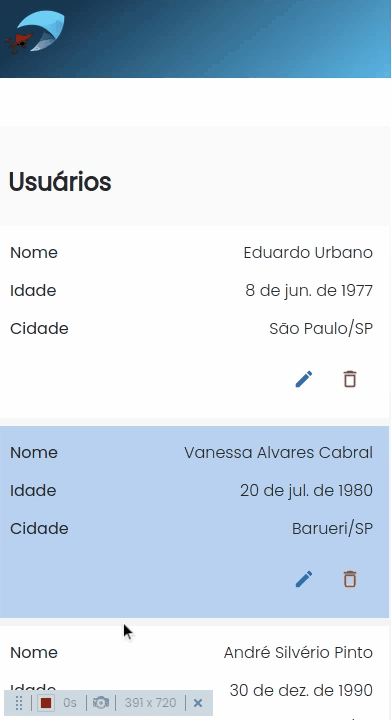
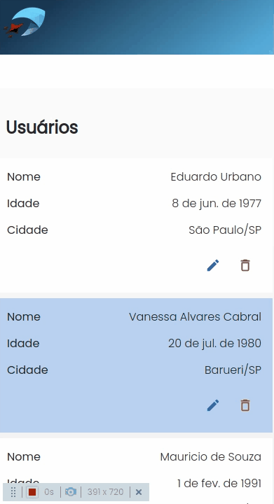
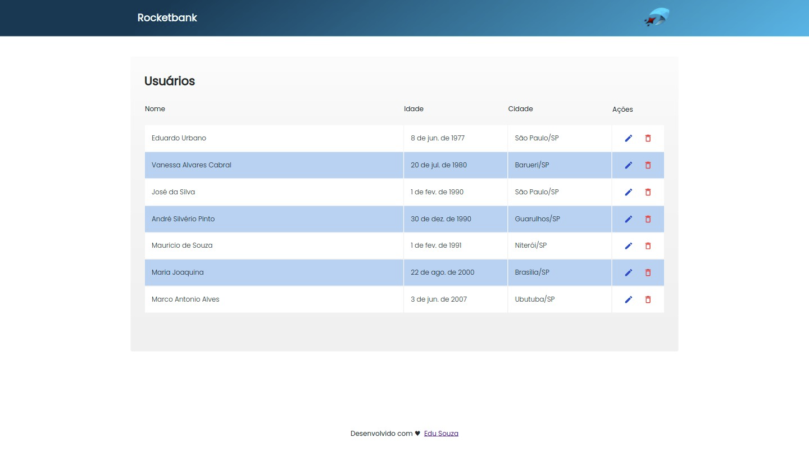
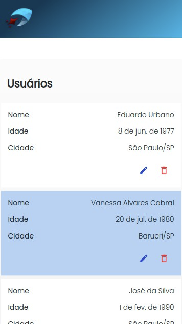

<br/>

<h5 align="center">
  
</h5>

<br/>

<h3 align="center">
  Desafio Rocketbank - Edu Souza o/
</h3>

<blockquote align="center">“As pessoas costumam dizer que a motivação não dura sempre. Bem, nem o efeito do banho, por isso recomenda-se diariamente - Zig Ziglar”</blockquote>

<h4 align="center">
  Repositório - Rocketbank processo seletivo
</h4>

<br/>

<p align="center">
  <a href="https://github.com/EduSouza-programmer"    target="_blank">
    
  </a>&nbsp;
  <a href="https://edusouza-programmer.github.io/" target="_blank">
    
  </a>&nbsp;
  <a href="https://opensource.org/licenses/MIT" >
    
  </a>
</p>

<p align="center">
  <a href="#rocket-Sobre-o-desafio">Sobre o Desafio</a>&nbsp; &nbsp; |&nbsp; &nbsp; 
  <a href="#-Tecnologias">Tecnologias</a>&nbsp; &nbsp; |&nbsp; &nbsp; 
  <a href="#postbox-Entrega">Entrega</a>&nbsp; &nbsp; |&nbsp; &nbsp; 
  <a href="#unlock-Licença">Licença</a>
</p>

<br/>

## :rocket: Sobre o desafio

#### Rocketbank

Em um mundo competitivo, é importante descobrir e destacar a sua diferança. Nosso trabalho começa ajudando a identificar quem você é, o que te faz único. 
Durante todo o processo de desenvolvimento, desde a concepção do produto até a entrega final, participaremos do processo de transofrmação digital da sua empresa - Rocketbank.

Este foi um desafio para testar as habilidades de Javascript, CSS e ReactJS. Um projeto simples e já em andamento, onde já havia algumas libs instaladas e algumas implementações. 
Com isso, era apenas da continuidade de acordo com as instruções nas demandas apresentadas neste [arquivo](./instructions/Readme.md). 
Achei muito legal e top tudo! Ainda mais porque na stack usava redux e redux saga! :smile: 


#### Screenshots / Gif's:

<details>
<summary>GIF's </summary>
<br/>
<p align=center>Suporte para 320px ~ 1920px</p>
<p align=center >
   &nbsp; &nbsp;
</p>

<br/>

<p align=center>Iteratividades</p>
  <p align=center >
     &nbsp;  
     &nbsp;
     &nbsp; &nbsp;
     
     
  </p>
</details>

<br/>
<br/>

<p align=center >
   &nbsp; &nbsp;
  
</p>

<br/>
<br/>

##  Tecnologias

Esse projeto foi desenvolvido com as seguintes tecnologias:

<table >
  <tr>
    <td align=center><a href="https://pt-br.reactjs.org/"><div>React</div></a></td>
    <td align=center><a href="https://nodejs.org/en/"><div>NodeJs</div></a> </td>
    <td align=center><a href="https://developer.mozilla.org/pt-BR/docs/Web/JavaScript"><div>Javascript</div></a> </td>
    <td align=center><a href="https://www.typescriptlang.org/"><div>Typescript</div></a></td>
    <td align=center><a href="https://redux.js.org/"><div>Redux</div></a></td>
    <td align=center><a href="https://redux-saga.js.org/"><div>Redux Saga</div></a></td>
    <td align=center><a href="https://styled-components.com/"><div>S.Comp</div></a></td>
    <td align=center><a href="https://prettier.io/"><div>Prettier</div></a></td>
  </tr>
</table>

<br/>

## :postbox: Entrega

Para executar o projeto basta seguir os passos abaixo.
#### Run :eyes:


1. Clone o repositório e abra a pasta dele:

```shell
$ git clone https://github.com/EduSouza-programmer/challenge_rocketbank-Edu_Souza 
```

2. Instale as dependência com `yarn` ou `npm`:

```shell
$ yarn install
```

3. Depois de clonar e instalar o repositório, rode o projeto em `localhost`:

```shell
$ yarn start
```

<br/>


#### Concluído :clipboard: 

Como mencionado acima, gostei muito do desafio e foi muito útil lembra do redux e redux saga srsrs :muscle:, isto porque em outros projeto estou usando o graphql e o apolo client para fazer o estado dos dados e 
todo o cache da aplicação, no entanto foi enriquecedor o desafio :+1:. Espero que gostem! Abaixo o link do deploy.

Acesse o deploy do projeto [aqui](https://edusouza-forks.github.io/simple-frontend-test).


<br/>

## :unlock: Licença

Este projeto está licenciado sob a Licença MIT - consulte [LICENSE](https://opensource.org/licenses/MIT) para maiores detalhes.
 

